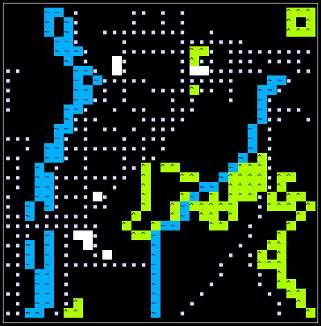
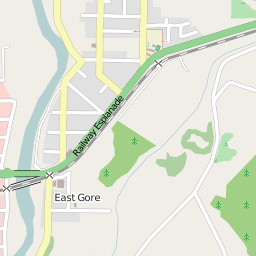

# vector-tile-ascii

ASCII renderer for OpenStreetMap vector tiles.




## Why?

Because it should be possible to download and view a single tile without configuring a massive Mapnik-based rendering infrastructure.


## Example

```bash
npm install -g vector-tile-ascii

# Fetch and decompress a vector tile from MapBox
curl --compressed -o 10561.vector.pbf \
  "https://a.tiles.mapbox.com/v3/mapbox.mapbox-streets-v5/14/15881/10561.vector.pbf"

# View the tile
vector-tile-ascii 10561.vector.pbf
```

Check it against the reference image:


